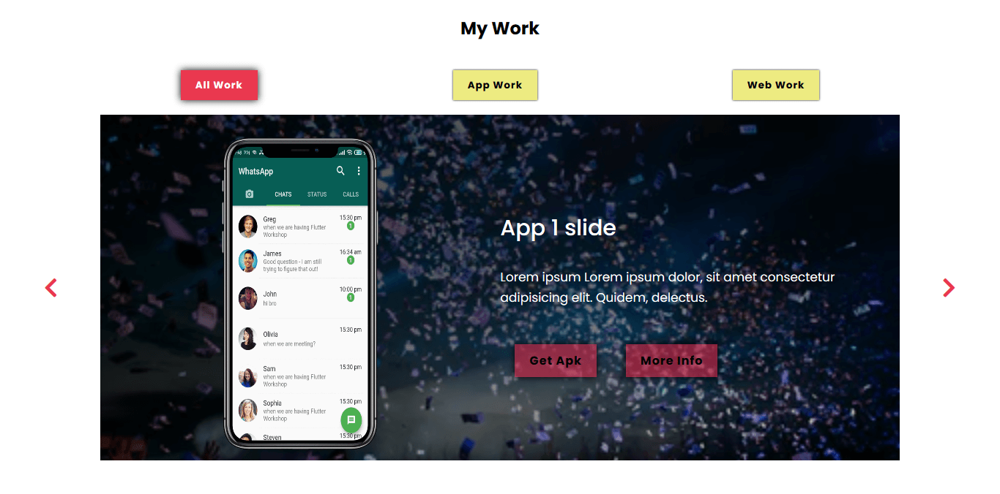
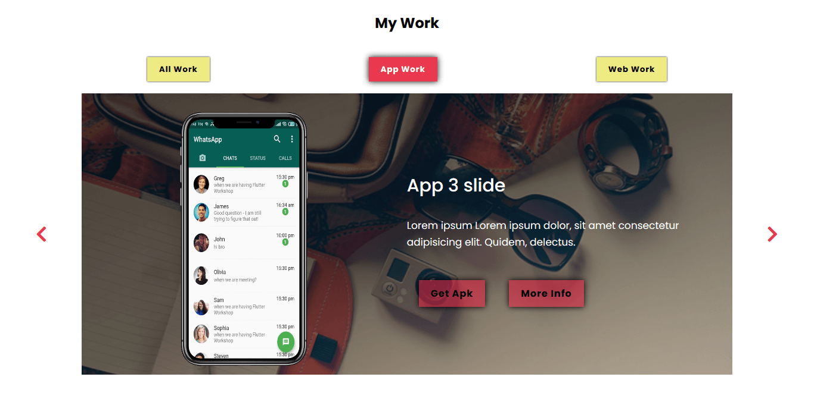
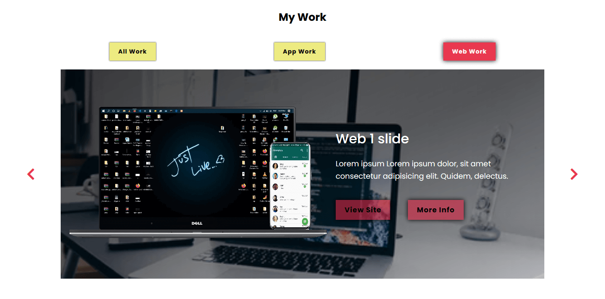

# JavaScript-Carousel
[view link](https://shahbajjamil.github.io/JavaScript-Carousel/)

javaScript carousel for work section with filter options of **"All Work"**, **"App Work"**, **"Web Work"** which is not functional and i have no idea how to make that work.

## ScreenShots

